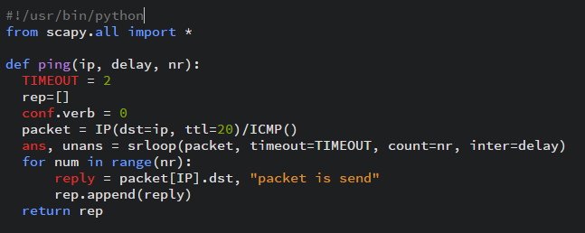
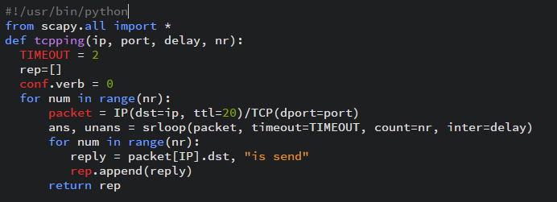
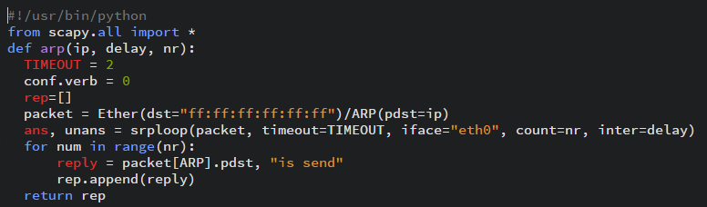
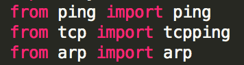
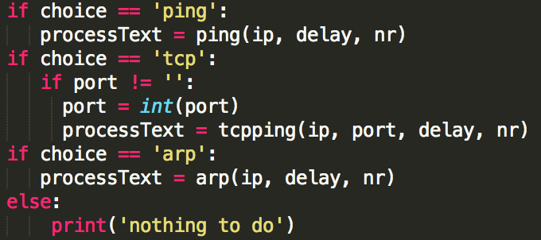
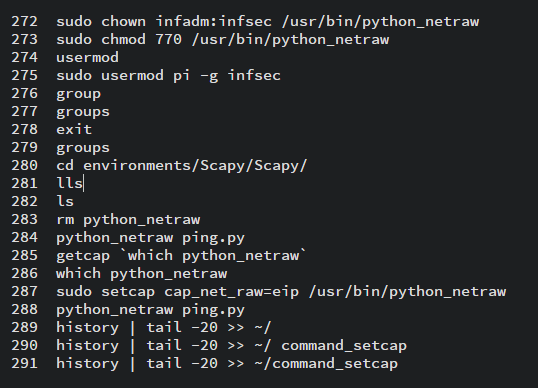
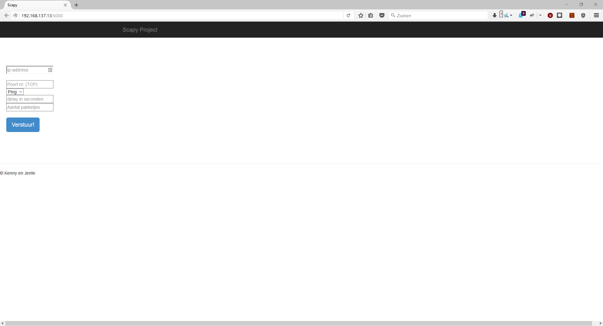

#Information security
##Scapy
Kenny Embrechts & Jente Adams

3EA1

##Voorwoord

We hebben voor dit project gekozen omdat het een uitdaging ging vormen. We hadden zelf nog nooit geprogrammeerd in Python dus hier gingen we zelf al heel veel van leren. We moesten Python dan gebruiken om via een website, waar je een interface had, scripts aan te roepen die je kan runnen die zich op een Raspberry Pi bevinden.

# Inhoudsopgave

[1. Inleiding](#Inleiding) 
[2. Specificaties](#Specificaties) 
>[2.1. Python](#Python) 
>>[2.1.1. Scapy](#Scapy) 
>>>[2.1.1.1. ping.py](#ping) 
>>>[2.1.1.2. tcp.py](#TCP) 
>>>[2.1.1.3. arp.py](#ARP) 

>>[2.1.2. Flask](#Flask) 
>>>[2.1.2.1. Scapy.py](#ScapyPy) 
>>>[2.1.2.2. Jinja2](#Jinja2) 
>>>[2.1.2.2. Werkzeug](#Werkzeug) 

>[2.2. Raspbian](#Raspbian) 
>>[2.2.1. SetCapabilities](#SetCap) 
>>[2.2.2. Start applicatie bij opstarten](#pythonOnBoot)

[3. Gebruiksinstructies](#deploy)

[4. Conclusie](#Conclusie)

#1. Inleiding

Het is een project dat op school kan gebruikt worden voor de 1ste jaars elektronica-ICT om zo hun packet sniffing skills te verbeteren. Er dient naar een website gesurft te worden, gehost op de Raspberry Pi en dan de juiste instellingen kiezen, wat met al een klein beetje netwerk kennis geen enkel probleem zou mogen zijn en dan sniffen maar.

Op deze manier kan je heel gemakkelijk fictief data verkeer maken. Dit data verkeer kan je opvullen met elk pakketje dat je maar wilt. Zo is het ook heel makkelijk te controleren of je het goede pakket te pakken hebt!

#2. Specificaties

We moesten werken met een Raspberry pi waar we Raspbian op geïnstalleerd hebben. Rasbian hebben we geïnstalleerd omdat deze Linux distributie gebasseerd is op Debian en omdat Debian gemakkelijk is om mee te leren werken en om mee te werken. We hebben Python gebruikt om de scripts mee te schrijven. Naast Python, hadden we dan ook de Scapy library nodig. Om de Scapy library te installeren hadden we nog een aantal andere programma's nodig waaronder: tcpdump, graphviz, imagemagick, python-gnuplot, python-crypto en python-pyx. Dez programma's worden gebruikt door Scapy om een aantal functies uit te voeren. Wij hebben namelijk enkel met tcpdump gewerkt om paketten te versturen, bewerken en te ontvangen. Daarnaast hadden we nog iets nodig om onze website mee op te bouwen. We hebben gekozen voor Flask, omdat Flask een Python framework is, konden we gemakkelijk onze scripts geschreven in Python laten uitvoeren door Flask, met het voordeel dat we geen data moesten gaan omvormen en rare dingen moesten doen in onze code om alles te laten werken. We gaan de componenten hieronder uitleggen, en dan toelichten hoe wij deze hebben gebruikt in ons project.

##2.1. Python

Python is een programmeertaal en een scripting taal. Wat Python anders maakt dan andere programeertalen en scriptingtalen is dat het zorgt voor een goede leesbaarheid van de code en dat het sneller is om te schrijven, een nadeel is echter de tijd om te compileren, maar doordat je snellere code schrijft wordt dit nadeel opgeheven en kan je sneller je project klaar hebben dan in andere talen.

Voor Python bestaan er ook vele libraries die je gratis kan downloaden voor data analyse. Aangezien deze tool op deze moment redelijk basis is, is dit dus handig om de tool in te toekomst mee uit te breiden. Omdat Python een 'leesbare' taal is, is het dus ook makkelijk te leren. Vele mensen die de principes van programmeren kennen, zullen dus heel snel weg zijn met Python (We hadden zelf nog nooit Python gebruikt, maar na een paar uurtjes waren we er helemaal mee weg).

###2.1.1. Scapy

Scapy is een pakket-manipulatie-tool geschreven in Python waarmee je paketten kan versturen, wijzigen, ontvangen. Je kan er ook aanvallen mee opzetten, traceroutes mee doen en nog veel meer. Wij gebruiken Scapy enkel om paketten mee te verzenden. Scapy wordt ook veel gebruik om veiligheid van netwerken mee te testen, of van een computer.

Een nadeel daarentegen is dat het Scapy niet snel is in het uitwisselen van data. Dit komt deels door het feit dat het in Python is geschreven. Wij hebben hier nu relatief weinig last van gehad omdat we met heel lichte en simpele scriptjes hebben gewerkt.

Een hele goede guide voor Scapy is [The Very Unofficial Dummies Guide To Scapy](http://scapy-guide.googlecode.com/files/ScapyGuide.pdf). Hieronder leg ik de code van de scripts uit.

####2.1.1.1. ping.py

Met `packet = IP(dst=ip, ttl=20)/ICMP()`  gaan we het pakket opbouwen. Het is een IP pakket met een destination address gelijk aan de waarde in de ip variabele, een time to live van 20 hops en we hangen aan het ip pakket ook een ICMP pakket voor de ping te versturen. 
Met `ans, unans = srloop(packet, timeout=TIMEOUT, count=nr, inter=delay)`
gaan we het pakket in een layer 3 loop steken. We geven ook een count mee, deze waarde wordt gebruikt om te definiëren hoeveel pakketen er verstuurd moeten worden, als er niets is ingevuld dan wordt het pakket een oneindig aantal keer verzonden. met `inter=delay` geven we mee hoeveel tijd er tussen de pakketen moet zitten. De loop kan twee antwoorden krijgen ofwel is het pakket beantwoord ofwel is de timeout verstereken.

####2.1.1.2. tcp.py

Het tcp.py script is bijna hetzelfde als het ping. py script, met als enig verschil dat we aan ons IP pakket geen ICMP pakket zetten maar een TCP pakket met een destination poort dat hij moet bereiken via `dport=port`.

####2.1.1.3. arp.py

Het grote verschil tussen het arp.py script en de andere scripts is dat inplaats van een layer 3 pakket er nu een layer 2 pakket wordt verzonden. met `packet = ETher(dst="ff:ff:ff:ff:ff:ff")/ARP(pdst=ip)` maken we een Ether() header met als destinaton het broadcst adres. Via `ARP(pdst=ip)` gaan we aan de Ether header een ARP pakket hangen die op zoek gaat naar het ip address mee gegeven in `pdst=ip`. 
met `ans, unans = srploop(packet, timeout=TIMEOUT, iface="eth0", count=nr, inter=delay)` gaan we ons pakket in een layer 2 loop steken. Hier is alles het zelfde buiten `srploop() in plaats van srloop()` en we geven een `iface="eth0"` parameter mee om Scapy te laten weten via welke verbinding hij dit pakket moet verzenden.

###2.1.2. Flask

Flask is een micro web applicatie framework dat in Python is geschreven. Het wordt zo genoemd omdat je er geen specifieke tool op library voor nodig hebt om het te laten werken. Als gebruiker van Flask ben je dus volledig vrijstaand welke tools en libraries je gaat gebruiken om je web applicatie mee te maken

Het biedt daarentegen wel veel extensies die je kan gebruiken, om je web applicatie extra features te geven. Indien je onze applicatie nog verder wil uitbreiden, zal Flask je daar genoeg opties voor geven.

Flask is ook volledig open source. Om de werking beter te begrijpen biedt het Flask Core team je de kans om de source code eens te bekijken. Je kan, indien je dit wil, dus ook meebouwen aan Flask. Er wordt altijd al gestimuleerd om, indien je bugs vindt, deze zo snel mogelijk te rapporteren.

####2.1.2.1. Scapy.py

Scapy.py is het script dat we aanroepen via de website. Het integreert alle scripts die we hebben (tcp, ping en arp) in 1 script zodat we makkelijk een pakket kunnen versturen vanuit 1 locatie.

Het script herkent dus om mee te beginnen, het type pakket dat je zal versturen. De data die hij nodig heeft, haalt hij uit de website via de POST methode.

Scapy.py gaat dan het pakket volledig opbouwen. Hij vult alle instellingen in (ofwel de gegeven instelling via de website, ofwel de standaard instellingen die wij hebben ingesteld). Als hij alle waarden heeft ingevuld, zal hij aan de hand van welk pakket en je wil sturen, één van de if structuren aanspreken.

Hij zal op de website ook laten zien hoeveel van de pakketjes al dien niet succeslvol zijn verstuurd en ontvangen.

####2.1.2.2. Jinja2

Jinja wordt gebruikt door Flask om templates te creëeren en wordt gepubliceerd onder de BSD licentie. Het maakt gebruik van template designer helpers zodat er een aantal taken vergemakkelijkt worden bij het templating. Het is een text gebaseerde template taal en kan dus worden gebruikt om elke mark-up alsook source code te schrijven. Het is ook een veilig systeem want het maakt gebruik van site cross scripting prevention technieken om dit XSS te voorkomen.

Je kan Jinja ook gebruikt om functies aan te roepen, met argument. Je kan je filters en tags customizen zodat je heel de engine kan gebruiken naar je eigen zin.

####2.1.2.3. Werkzeug

Werzeug is een WSGI(WebServer Gateway Interface). Dit is een specificatie voor web servers en web applicaties. Nieuwe gebruikers van Python hadden vroeger veel problemen met het gebruik van frameworks voor Python omdat deze de keuze van web servers verminderde, met het gebruik van WSGI werd dit probleem opgelost.

Werkzeug was een simpele collectie van verschillende WSGI applicaties maar is tegenwoordig één van de meest geavanceerde WSGI tool bechikbaar. Het bevat onderandere een krachtige debugger, een routing systeem, een systeem voor cookies te beheren, een fileuploader en cache control.

##2.2. Raspbian

Raspbian is een free software gebaseerd op Debian, geoptimaliseerd om te werken op de architecturen voor de Raspberry Pi. Raspbian voorziet ook 35000 ‘packages’ om te installeren, waardoor je applicaties makkelijker kan maken en ondersteunen. Hoewel Raspbian gereleased is in 2012, worden er nog altijd ‘packages’ gemaakt of ‘vertaald’ van Debian, om de ondersteuning nog groter te maken. Omdat Raspbian gebaseerd is op Debian en Debian niet zo moeilijk is om mee te werken en zeer stabiel is, is dit een zeer goed besturingssysteem voor onze web applicatie.

###2.2.1. Set Capabilities

Omdat we root rechten nodig hebben om paketten via de Scapy library door te sturen zouden studenten onze webapplicatie niet kunnen gebruiken omdat ze dan ook alles kunnnen aanpassen in Raspbian. Om dit te kunnen oplossen bestaat er een functie set capabilities in het libcap paket voor Rasbian. Dit stelt gebruikers instaat om bepaalde programma's te gebruiken zonder dat daar root rechten voor nodig zijn. Hieronder wordt uitgelegd hoe set capabilities werkt.

Met het `sudo chown infadm:infsex /usr/bin/python_netraw` commando gaan we `python_netraw` een nieuwe eigenaar geven `infadm` en aan een nieuwe groep toevoegen `infsec`. Met het commando `sudo chmod 770 /usr/bin/python_netraw` gaan we de eigenaar en de groep alle rechten geven om `python_netraw` te lezen, te wijzigen en uitvoeren. Dit zorgt ervoor dat niet zomaar iedereen `python_netraw` kan uitvoeren. Via het commando `sudo usermod pi -g infsec` gaan we de pi gebruiker toevoegen aan de groep infsec, zodat de pi gebruiker `python_netraw` kan uitvoeren. Via het commando `sudo setcap cap_net_raw=eip /usr/bin/python_netraw` gaan we ervoor zorgen dat python_netraw kan uitgevoerd worden zonder dat er root rechten voor nodig zijn maar enkel door de eigenaar of door de groep, waardoor er geen sudo rechten gegeven moet worden aan studenten om zo het systeem beter te beveiligen tegen opzettelijke vandalisering van het systeem.

###2.2.2. Start applicatie bij opstarten

Om onze webapplicatie te kunnen opstarten als Raspbian boot en om alles klaar te maken voor productie heb ik een nieuwe gebruiker aangemaakt Scapy die geen sudo rechten heeft en deze toegevoegd aan de groep infsec. Daarna heb ik alles gekopieerd naar de home folder van de scapy gebruiker en ervoor gezorgd dat de bestanden van onze webapplicatie beveiligd zijn tegen wijzigen. Daarna heb ik `python_netraw /home/scapy/Scapy/Scpay.py &` toegevoegd aan ~/.profile. het & teken zorgt ervoor dat python_netraw gestart wordt in de achtergrond.

#3 Gebruiksinstructies

Om onze webapplicatie te gebruiken moet je enkele stappen doorlopen: 
1. De Raspberry Pi aanzetten met een netwerkkabel aangesloten.  
2. Het IP adres van je ethernet aansluiting wijzigen naar `192.168.137.13` via Configuratiescherm >          Netwerkcentrum > Adaper instellingen wijzigen > rechtermuisklik op Lan-verbinding > Eigenschappen > Internet protocol versie 4 (TCP/IPv4) > Eigenschappen > Het volgende ip address gebruiken en bij IP-adres `192.168.137.13` invullen > bij subnetmasker klikken > op OK klikken en alles sluiten. 
3. Naar `192.168.137.13:5000` surfen. 
 
4. De juiste gegevens invullen en op de knop `verstuur!` klikken.  

#4 Conclusie

We hebben enorm veel geleerd van dit project. Niet alleen Python, maar ook Linux. De extra programmeertaal waar we nu van hebben geproefd, smaakt naar meer en is zeer gemakkelijk te gebruiken. Ook het doorsturen van data van HTML naar Python is handig om te weten.

Het is spijtig dat dit project ten einde is, we hadden hier graag nog verder mee geëxperimenteerd om te kijken of we nog meer soorten pakketen en meer instellingen konden genereren voor de pakket generator. 

Wij zijn er zeker van dat een project als dit de eerstejaars kan helpen om hun ontwikkeling van packet sniffing verder uit te breiden.
